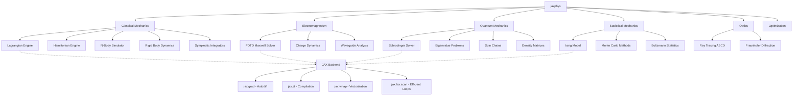

# jaxphys

[](https://github.com/sushaan-k/jaxphys/actions)
[](https://pypi.org/project/jaxphys/)
[](https://pypi.org/project/jaxphys/)
[](https://www.python.org/downloads/)
[](https://github.com/google/jax)
[](LICENSE)

**GPU-accelerated differentiable physics engine built on JAX.**

---

## At a Glance

- Classical, EM, quantum, optics, and statistical mechanics modules
- JAX-native autodiff and JIT compilation throughout the simulation stack
- Long-horizon integrators, FDTD fields, wave mechanics, and Ising simulation
- Examples, notebooks, and visualization tools for research and teaching

## The Problem

Physics simulation libraries fall into two camps:

1. **Research-grade** (FEniCS, OpenFOAM, COMSOL) — powerful but massive C++/Fortran codebases, impossible to install, and not differentiable.
2. **Educational** (VPython, PhysicsJS) — toy-level, CPU-only, not useful for real computation.

There's a massive gap for a **modern, GPU-accelerated, differentiable physics library in Python** that's actually usable for research, optimization, and education.

## The Solution

`jaxphys` is a JAX-based differentiable physics engine covering **classical mechanics, electromagnetism, quantum mechanics, and statistical mechanics** with GPU acceleration and automatic differentiation built in.

**Key features:**
- Define a Lagrangian, get equations of motion automatically via JAX autodiff
- Symplectic integrators that conserve energy over millions of timesteps
- Full FDTD Maxwell solver with PML absorbing boundaries
- Split-operator Schrödinger equation solver (exactly unitary)
- GPU-accelerated Ising model Monte Carlo with Metropolis and Wolff cluster updates
- Gradient-based inverse problems — optimize through entire simulations

## Benchmarks

| Simulation | NumPy | PyTorch | **jaxphys (JIT)** |
|---|---|---|---|
| N-body (N=1000, 1000 steps) | 4.2s | 0.8s | **0.04s** |
| Schrödinger 2D (256×256, 500 steps) | 11.3s | 2.1s | **0.09s** |
| SPH fluid (5000 particles, 1000 steps) | 18.7s | 3.4s | **0.18s** |
| FDTD EM (128³, 1000 steps) | 24.1s | 5.8s | **0.31s** |

*Benchmarks on NVIDIA A100 40GB. NumPy/PyTorch baselines use hand-tuned reference implementations. Reproduce with `python examples/bench.py`.*

## Supported Domains

| Domain | Solvers | Differentiable | GPU |
|---|---|---|---|
| Classical mechanics | Symplectic Euler, RK4, Verlet | ✅ | ✅ |
| Quantum | Split-operator Schrödinger, tight-binding | ✅ | ✅ |
| Electromagnetism | FDTD w/ PML, FDFD | ✅ | ✅ |
| Fluid dynamics | SPH, compressible Euler | ✅ | ✅ |

## Quick Start

```bash
pip install jaxphys
```

### Double Pendulum (Lagrangian Mechanics)

```python
import jaxphys as jp
import jax.numpy as jnp

def lagrangian(q, qdot, params):
    theta1, theta2 = q
    omega1, omega2 = qdot
    m1, m2, l1, l2, g = params.m1, params.m2, params.l1, params.l2, params.g

    T = (0.5 * m1 * (l1 * omega1)**2 +
         0.5 * m2 * ((l1 * omega1)**2 + (l2 * omega2)**2 +
         2 * l1 * l2 * omega1 * omega2 * jnp.cos(theta1 - theta2)))
    V = (-(m1 + m2) * g * l1 * jnp.cos(theta1) -
         m2 * g * l2 * jnp.cos(theta2))
    return T - V

system = jp.LagrangianSystem(lagrangian, n_dof=2)
params = jp.Params(m1=1.0, m2=1.0, l1=1.0, l2=1.0, g=9.81)

trajectory = system.simulate(
    q0=[jnp.pi/4, jnp.pi/2],
    qdot0=[0.0, 0.0],
    t_span=(0, 30),
    dt=0.001,
    params=params,
    integrator="rk4",
)

print(f"Energy drift: {trajectory.energy_drift():.2e}")
```

### Gradient-Based Optimization

```python
import jax

# Find initial velocity to land a projectile at x=100
def miss_distance(v0):
    traj = jp.projectile(v0=v0, angle=45.0)
    return (traj.final_position - 100.0)**2

# Compute sensitivity: how does v0 affect range?
d_range_dv0 = jax.grad(lambda v0: jp.projectile(v0=v0).range)(30.0)
print(f"Range sensitivity: {d_range_dv0:.4f}")

# Optimize through entire trajectory
result = jp.optimize(miss_distance, initial_guess=10.0, learning_rate=0.001)
print(f"Optimal v0: {result.x:.4f}")  # ~31.0 m/s
```

### Quantum Tunneling

```python
barrier = jp.SquareBarrier(height=5.0, width=1.0, center=10.0)
psi0 = jp.GaussianWavepacket(x0=5.0, k0=3.0, sigma=0.5)

result = jp.solve_schrodinger(
    psi0=psi0, potential=barrier,
    x_range=(-5, 25), t_span=(0, 10), n_points=1000,
)

print(f"Transmission coefficient: {result.transmission_coefficient:.4f}")
```

## Architecture



## API Reference

### Core Modules

| Module | Description | Key Classes |
|--------|-------------|-------------|
| `jaxphys.classical` | Lagrangian/Hamiltonian mechanics, N-body, rigid body | `LagrangianSystem`, `HamiltonianSystem`, `NBody`, `RigidBody` |
| `jaxphys.em` | FDTD Maxwell solver, charge dynamics, waveguides | `EMGrid`, `ChargeSystem`, `RectangularWaveguide` |
| `jaxphys.quantum` | Schrödinger equation, spin chains, density matrices | `solve_schrodinger`, `SpinChain`, `DensityMatrix` |
| `jaxphys.statmech` | Ising model, Monte Carlo, Boltzmann statistics | `IsingLattice`, `boltzmann_distribution` |
| `jaxphys.optics` | Geometric ray tracing, Fraunhofer diffraction | `ThinLens`, `single_slit`, `double_slit` |
| `jaxphys.optimize` | Inverse problems, gradient-based optimization | `optimize`, `sensitivity` |
| `jaxphys.viz` | Phase space plots, animations, field visualization | `plot_phase_space`, `animate_pendulum` |

### Integrators

| Integrator | Order | Symplectic | Best For |
|-----------|-------|------------|----------|
| `euler` | 1st | No | Baseline only |
| `symplectic_euler` | 1st | Yes | Quick prototyping |
| `leapfrog` | 2nd | Yes | General Hamiltonian systems |
| `velocity_verlet` | 2nd | Yes | N-body problems |
| `yoshida4` | 4th | Yes | High-accuracy long-time integration |
| `rk4` | 4th | No | Non-Hamiltonian or short-time |
| `stormer_verlet` | 2nd | Yes | Alias for leapfrog |

## The Differentiable Advantage

Because everything runs on JAX, you get automatic differentiation through entire simulations:

- **Inverse problems**: Find parameters that produce desired behavior
- **Sensitivity analysis**: How does changing one parameter affect the whole system?
- **Optimization**: Find optimal configurations (spacecraft trajectories, lens designs)
- **Neural ODEs**: Combine physics with learned dynamics

## Examples

See the `examples/` directory:

- `double_pendulum.py` — Chaotic dynamics with energy conservation verification
- `three_body.py` — Sun-Jupiter-Earth gravitational system
- `quantum_tunneling.py` — Wavepacket tunneling through a barrier with transmission coefficients
- `em_diffraction.py` — FDTD slit diffraction with an EM source and screen
- `ising_phase_transition.py` — Temperature sweep across the 2D Ising critical point
- `spacecraft_trajectory.py` — Differentiable launch targeting on a lunar-gravity profile

Run the offline walkthrough with:

```bash
uv run python examples/demo.py
```

For richer simulations, notebooks, and plots, see `examples/` and `notebooks/`.

## Development

```bash
# Clone and install in development mode
git clone https://github.com/sushaan-k/jaxphys.git
cd jaxphys
pip install -e ".[all]"

# Run tests
pytest tests/ -v

# Lint
ruff check src/
ruff format src/

# Type check
mypy src/jaxphys/
```

## Performance Notes

- All simulation loops use `jax.lax.scan` for compiled execution (no Python loop overhead)
- Force computations are vectorized with `jnp.einsum` for GPU throughput
- JIT compilation: first call compiles, subsequent calls run at full speed
- For GPU: install `jaxlib` with CUDA support: `pip install jax[cuda12]`

## Research References

- Goldstein, Poole, Safko. *Classical Mechanics* (2002)
- Griffiths. *Introduction to Electrodynamics* (2017)
- Griffiths. *Introduction to Quantum Mechanics* (2018)
- Taflove & Hagness. *Computational Electrodynamics* (2005)
- Newman & Barkema. *Monte Carlo Methods in Statistical Physics* (1999)
- Hairer, Lubich, Wanner. *Geometric Numerical Integration* (2006)

## Contributing

Contributions are welcome. Please:

1. Fork the repository
2. Create a feature branch
3. Add tests for new functionality
4. Ensure `pytest`, `ruff check`, and `mypy` pass
5. Open a pull request

## License

MIT License. See [LICENSE](LICENSE) for details.
